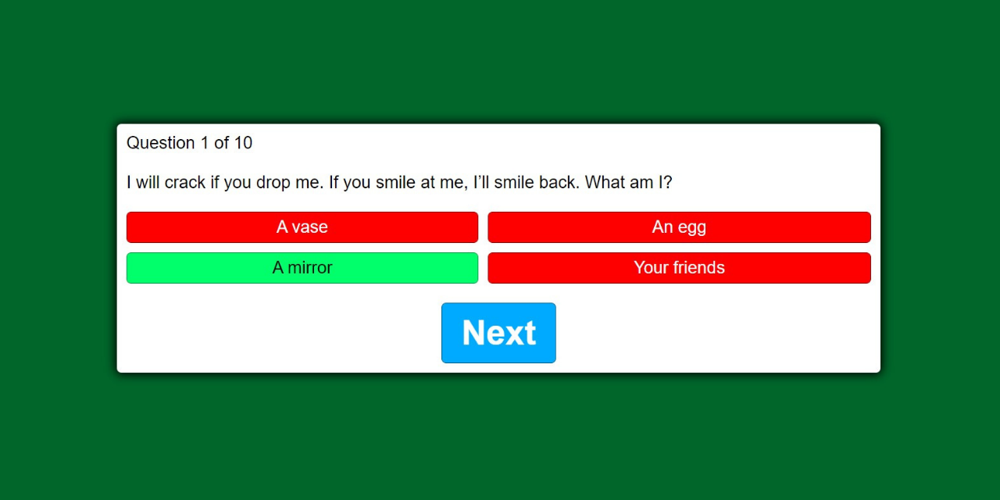

# Web-based Quiz Application using JavaScript, CSS, and HTML Programming Languages
This is a final project of the Web Programming course. This is a simple web-based quiz application using JavaScript, CSS, and HTML programming languages. This quiz contains 10 questions with +10 points if the answer is correct and the result will be in a form of a percentage based on the user's correct answer with a 'restart' button at the end of the quiz that is used to restart the quiz and to start/play the quiz, you may run the index.html file but to access this web-based quiz is still using localhost.

